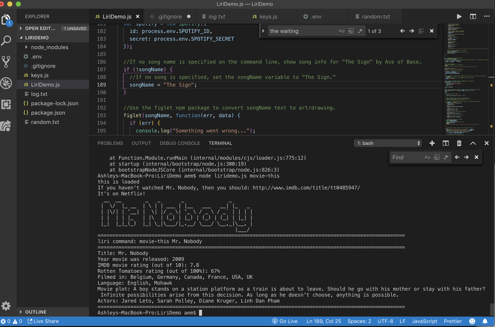

# liri-bot

# About
LIRI is like iPhone's SIRI. However, while SIRI is a Speech Interpretation and Recognition Interface, LIRI is a language Interpretation and Recognition Interface. LIRI isa command line node app that takes in parameters and gives you back data.

# Installing

These instructions will get you a copy of the project up and running on your local machine for development and testing purposes.

Download the directory form git hub:

$ git clone: https://github.com/ashleymcc/liri-bot
$ cd [liri-node-app]
Using terminal (bash/cmd) run npm install from the [liri-bot] directory retrieve node modules

Next, change the name of .env.example to .env, replacing the values with your API keys (no quotes) once you have them:

This file will be used by the dotenv package to set what are known as environment variables to the global process.env object in node.

Since you are using a clone this app from github and run to run it, you need to supply your own .env file for it to work.

The Spotify API requires you sign up as a developer to generate the necessary credentials. You can follow these steps in order to generate a client id and client secret:

Step One: Visit https://developer.spotify.com/my-applications/#!/

Step Two: Either login to your existing Spotify account or create a new one (a free account is fine) and log in.

Step Three: Once logged in, navigate to https://developer.spotify.com/my-applications/#!/applications/create to register a new application to be used with the Spotify API. You can fill in whatever you'd like for these fields. When finished, click the "complete" button.

Step Four: On the next screen, scroll down to where you see your client id and client secret. Copy these values down somewhere, you'll need them to use the Spotify API and the node-spotify-api package.

# Getting Started

Using terminal
Go to host directory: $ liri-bot

Get Song Info

Retrieves song information for 10 songs:
node liridemo.js spotify-this-song <song name>

Get Movie Info

Retrieves movie information:
node liridemo.js movie-this <movie name>

## Screenshots from the app in action:
Retrieves movie information:node liridemo.js movie-this finding nemo

Retrieves "Mr. Nobody" information when no movie name is provided :node liridemo.js movie-this
  

Retrieves "The Sign" information when no song name is provided :node liridemo.js spotify-this-song 

Retrieves song information for 10 songs: node liridemo.js spotify-this-song poker face

